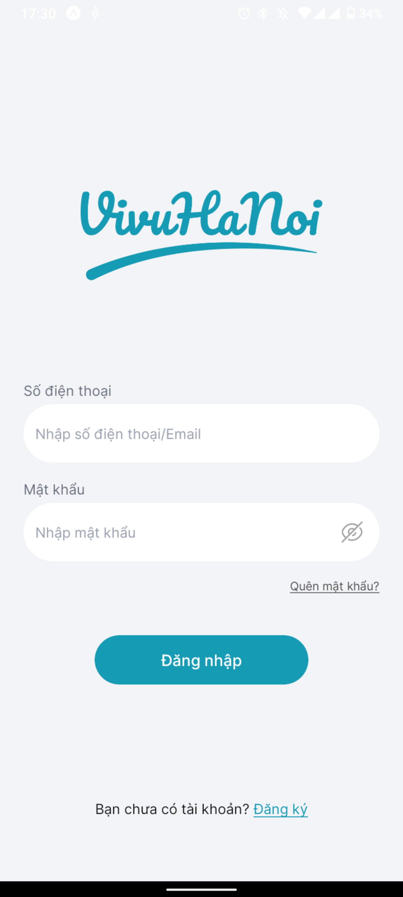
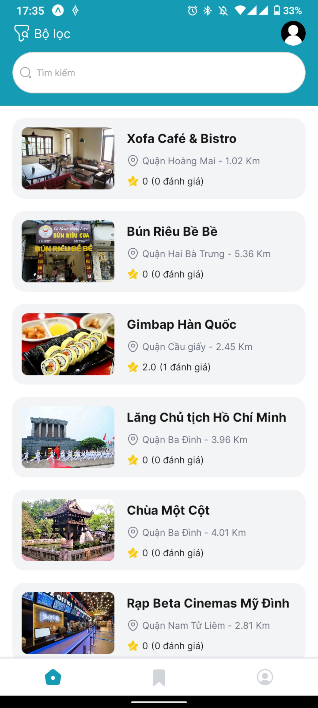
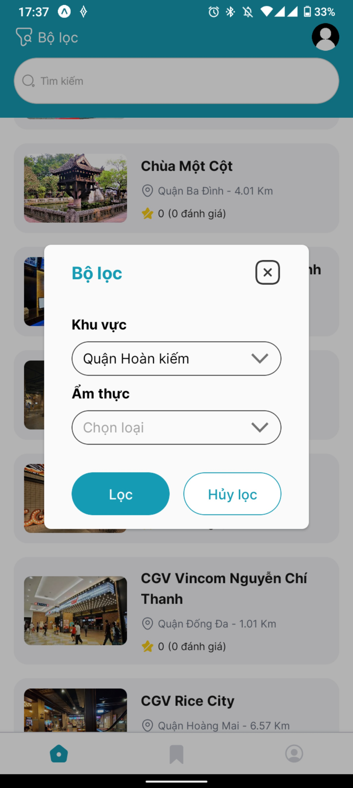
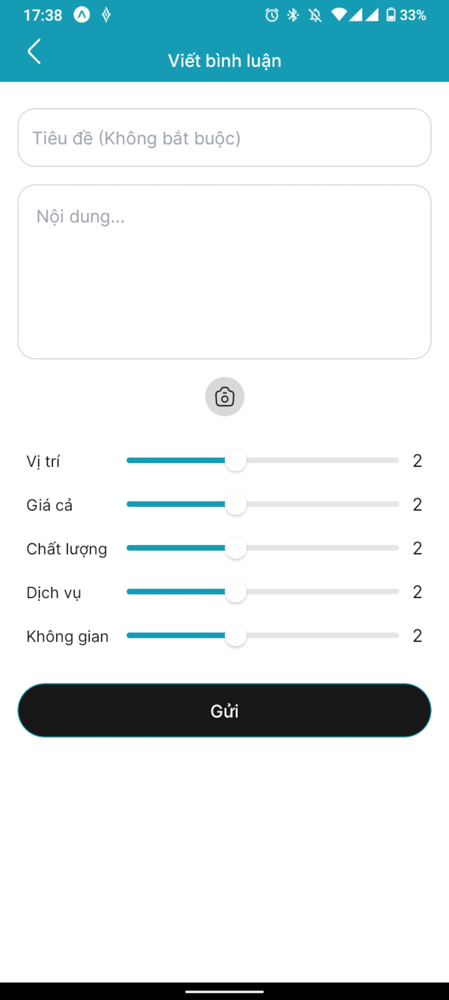
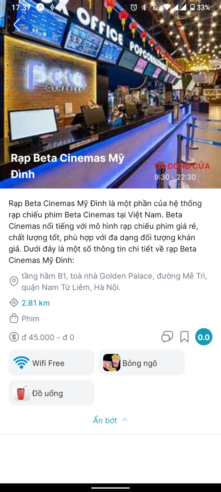
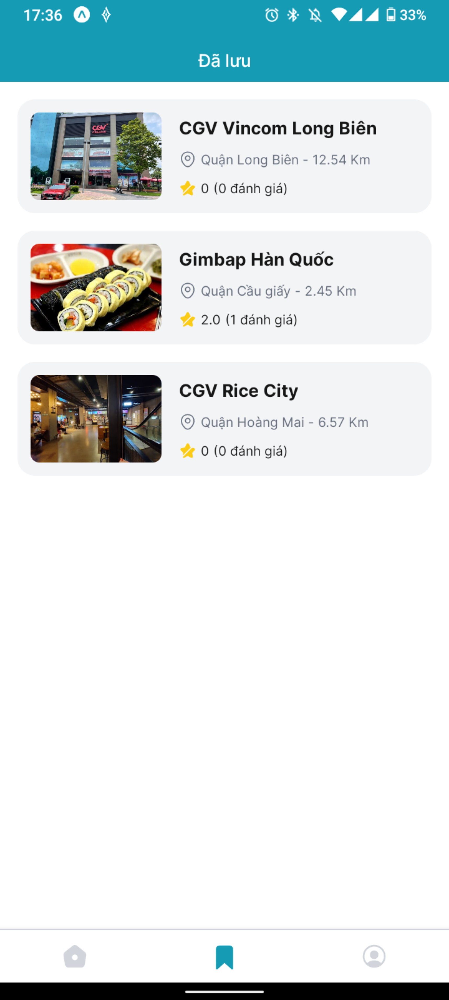
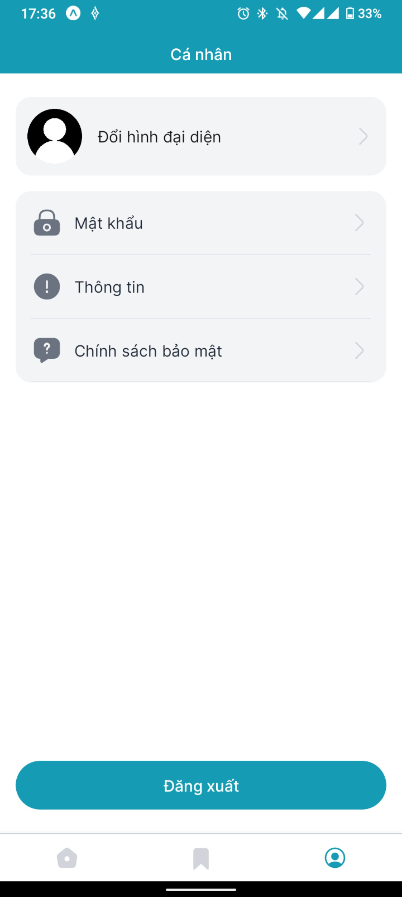
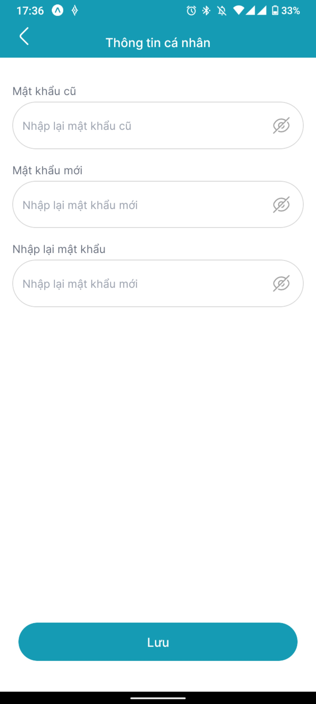
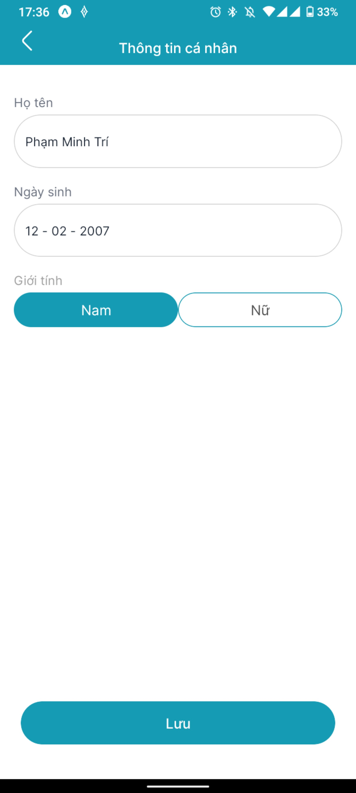

# Foodo


## App Introduction


## Table of Contents

- [Table of Contents](#table-of-contents)
  - [About](#about)
  - [Features](#features)
  - [Screenshots](#screenshots)
  - [Future Plans](#future-plans)
  - [Experience The Demo of Foodo](#experience-the-demo-of-Foodo)
    - [Prerequisites](#prerequisites)
    - [Installation](#installation)

## About

VivuApp is a mobile app that helps user discover and enjoy the best street food and small restaurants in Hanoi. With Foodo, you can find hidden gems that you wouldn't find on other apps, and make the decision of where to eat quickly and easily.

The app offers a searchable and sortable list of street vendors and small restaurants, so user can find the perfect place to eat based on their preferences, such as cuisine and location.

Foodo aims to make dining out fun and efficient, and encourages you to explore the Hanoi's diverse and delicious culinary scene.

## Features

- Creating and logging into your own account
- Search for restaurants near you
- Filter restaurants by name, category, and distance
- Read and write reviews from other users
- Add restaurants to your favourites list

## Screenshots

<p float='left'>









</p>

## Future-plans
- A map-based view of all restaurants in the app
- A form for users to upload their favourite street vendors that don't receive much attention
- The ability to filter restaurants by price and dietary restrictions
- The ability to make reservations directly through the app
- Expanding the app to other cities in Vietnam

## Experience the demo of Foodo

### Prerequisites

- Node.Js: https://nodejs.org/en
- Expo: https://docs.expo.dev/get-started/installation/
- Yarn: https://classic.yarnpkg.com/lang/en/docs/install/#mac-stable

### Installation

- Clone the repository to your local machine
- Install dependencies using npm or yarn
- Run the app using `yarn start` or another suitable command

```bash
git clone https://github.com/phan1232/vi-vu-expo-app
cd expo-project
yarn
yarn start
```
